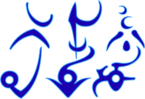

#### Pronunciation

Glyph | Orthographic | English | [IPA](http://www.ipachart.com/) |
------|------|---------|-----|
| b | **b**o**b** |**b**
| a | popc**aa**n |**a**
| à | d**a**rt    |**ɑ**
| d | **d**im     |**d**
| u | d**u**ke    |**u**
| ù | b**u**d     |**ɞ**
| k | **c**old    |**kʼ**
| i | k**e**y     |**i**
| ì | b**i**t     |**ɪ**
| p | **p**ost    |**p**
| e | m**a**y     |**e**
| è | g**e**t     |**æ**
| o | h**o**t     |**o**
| g | **g**or**g**on|**ɢ**
| j | **y**o**y**o|**j**
| t | **t**op     |**ʈ͡ʂ**
| h | **h**ealth  |**ɦ**
| s |  | **s**
| z |  | **z**
| n |  | **n**
| m |  | **ɱ**
| r |  | **r**
| f |  | **f**
| l |  | **l**
| w |  | **w**

##### [**Ufdu bodune o gro ti jo; gawàki bogane o jidukin lotogane groduplithf**](https://raw.githubusercontent.com/LucKeyProductions/MastersOfOneiron/master/Resources/Samples/Voice/UfduBodune.ogg)

#### Baduki

Syllable | Meaning
---------|---------
ba       | word/syllable/sound/bla
du       | collection
ki       | the

Baduki is the language of the Ekelpliths

---------------------------------

#### Ekelplitfkin

Syllable | Meaning
---------|---------
èk       | two
èl       | blade
plitf   | rizen
kin      | the (plural)

The Ekelplithfs are very proud of the fact they manage to walk. The fins  at the end of their legs are not strong enough for this and therefor walking required both these fins as well as their kneefins (èln).

#### Brèkèlega

Syllable | Meaning
---------|---------
brèk     | martial
èl       | blade
ega      | dance
e        | feeling/awareness
ga       | move

The Brèkèlega dance utilizes the Èkèlplithfs' finblades as weapons.

---------------------------------

## Syllables

### Numbers (duban)

Syllable | Meaning
---------|---------
uf	      | zero / none / nothing
ut	      | one 
ek       | two
ur	      | three
art      | four
|
oz	      | five
zik      | ten
uzu      | fifteen
zàt      | twenty

### Postfixes

 Postfix | Meaning
---------|---------
-N	     | plural
-KI      | the (unique)
-KIN     | the (unique plural)
-NE	     | verbal / doing
-NI      | not doing
-R       | possessive

### Prefixes

Prefix | Meaning
-------|---------
NI-    | negating / opposite

### Pronouns

Word  | Nominative  | Reflexive | Possessive
------|-------------|-----------|------------
MI    | I           | me 		| mine
MIN   | we          | us		| our
JU    | you 		| you 		| your
JUN   | you 		| you       | your
DÈ    | he/she	    | him/her   | his/hers
DÈN   | they 		| them      | their
TÈ    | this/that   | it        | its
TÈN   | these/those | them      | their

### Roots

Syllable | Meaning
---------|---------
A | sound / aum / vowel
À | interruption
J | soul
I | atom / grain / particle / little / bit
B | collision / consonant
R | vibration / wave / resonance
E | feeling/awareness/conscience
È | unknown / dunno
O | and / plus / more / hand
F | light
G | weight / mass
D | persistent / still
Z | next / sideways / left
Ù | huh? / what?
U | or / other
H | breath / air / gap
ZÙ | right?
TI | am / is / are
TÀ | material / resource / thing
WÀ | create / source
LI | will / is going to / are going to
BA | word / syllable
BO | great / good / beautiful
BR | damage / result / effect
HU | fear
HO | respect / hi 
EL | blade
TO | with / along / towards / downstream
LO | aim / goal / target
RI | tooth
JI | person / entity
YO | special / scarce / heartfelt
LA | marks the beginning of a question (will, what, where, etc.)
PL | push/pull/force
IPL | careful
SER	| sharp
NIZ | previous / right
BRO | then
BRU | else
BRUT | pain / suffering / burden
BRUF | meaningless
BREK | martial / fight / split
DA | thank
DAN | thanks for / gratitude
DU | collection
RO | power / cycle / reign / rule
GA | movement
GRO | ground
**!**HAM | exchange
PLITH | against / towards source / upstream

-----------------------

## Assembled words

Word     | Meaning
---------|---------
BA-NI | silence
BA-DU-NE	| singing / telling a story
I-DU | dust
TA-DU | stock / belongings
BA-TA | dictionary
BA-DU-TA | book
BA-DU-WA-JI | singer / poet / writer / story teller
HO-NE | to greet
WA-NE | to create
BO-WA-JI-KI	| The supplier of goodness
BA-HAM | conversation
BA-DU | language / song / story
E-PLITH | empathy
E-DU | atmosphere
E-WA | heart
E-NE | to feel / to notice / to being aware (of) / to know
YO-E | love
YO-E-BA-DU 	| love song
BO-BA 	| compliment / praise
BOBA-DU 	| canticle
BREK-BA 	| insult
BREKBA-DU| diss rap
DAN-BA-DU| paean
GA-JI 	| mover
GRO-TA 	| soil
GRO-TO   | gravity
F-TO		| in(ward)
F-LO     | out(ward)
F-E-NE-TA| eye
F-WA		| light source
FWA-KI	| the nucleus
FWA-TA   | torch
FUF      | darkness
FUF-HU   | fear of the dark
GRO-DU 	| platform
GRO-GA-JI| ground mover
EGA-JI 	| dancer
WA-JI    | creator
UT-TA-WAJI 	| specialist / craftsman
EL-WAJI  | blacksmith
DU-WAJI  | collector
EL-WA-NE| smithing
HAM-DU 	| market
HAM-NE 	| to trade
HAM-JI 	| trader
DU-JI 	| member
JI-DU 	| group
JIDU-KI	| the clan
HU-JI | wimp
HU-WAJI | creep
JO-JO 	| magic
JOJO-NE	| casting
JOJO-WA | mana / qi
JOJO-TA  | ectoplasm
HU-WA-JI | boogie man
JOJO-HU-WA-JI| ghost
JOJO-JI 	| mage
JOJO-KI 	| the great work
JOJO-BA 	| spell
JOJO-BOBA| blessing
JOJO-BRUTBA	| curse
DA-TA 	| gift
SER-RI 	| wolf
BREK-SERRI 	| war dog
UF-HU 	| fearless / bravery
UFHU-JI	| hero / fool / dare devil
UR-HO 	| unity / peace / honor / admiration
RO-JI | ruler (e.g. king)
BA-WA		| mouth
LO-TO		| path
LOTO-GA	| journey
LOTOGA-NE| traveling
LOTOGA-JI| traveler
PLITH-E	| balance
GRODU-WANE	| platforming
GA-NE		| moving
BA-WA-NE	| making sound / informal speaking
UF-NE		| to rest
E-UF-NE	| navel-gazing / being bored
E-UT-NE  | meditation
UF-NE-JI	| idle person
EK-NE		| dividing
OT-NE		| uniting
SERRI-GA-NE	| dog riding
BREK-SERRI-GA-JI	| dog riders
GA-WA		| motor
GAWA-KI	| time
O-NE		| joining / adding / increasing
JU; O-NE-MIN	| you; join us
ONEMI(N)-JI	| guest / newcomer (the person that joined me/us)
RI-NE		| biting
BREK-RINE| chewing / munching
BO-GA		| fast / quick

-----------------------

## Sentences

**Serrin zo Ô nizo; min li brekne ten**  
Dogs left and right; we will fight them

**Den hone min**  
They're greeting us

**Mi gane**  
I'm moving/going

**Min ti serrin!!!**  
We are wolves!!!

**Dan Egaham**  
Thanks for your cooperation / It was a pleasure working together / _Thanks for this dance_

**Ti bo**  
Take care / be nice / you're good

**Mi hone yur**  
I greet you

**Mir hon ti yur**  
You have my respect

**Bu te egani, bru te badu**  
If it don't dance... else it's a story
