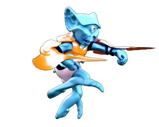

# [:four_leaf_clover:](http://www.luckeyproductions.nl/)

### Story

Two seconds ago both hemisphere leaders of the Progenitors simultaniously blew up Earth, with the very same latest top-secret technology, in an attempt to end all wars. The resulting blast travels so fast that real time is overtaken by imaginary time allowing for new life forms to come into existence in what we would experience as a single second. The blast force is compensated by gravity which reaches an equilibrium at a certain radius where the debris forms a shell of platforms that have a light and a dark side. | 
---|---
 | The Ekelplitf is most comfortable in the light and a fast swimmer. Their main crop which is both their main source of food and construction material is frop.
The Gogoltov prefers the dark, although the light coming through between platforms does allow them to fly. Magic mushrooms are their main diet, and as such their are masters of magic and in full contact with nature. They can learn to make plants and mushrooms - that are native to the _outside_ of Oneiron - grow into complex structures. |  
 | Despite their great differences, they will have to be united to restore peace and undo the destruction of Earth.
### Screenshot
